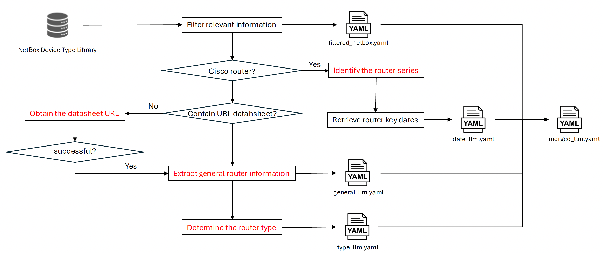

# NetBox Dataset Arista, Cisco and Juniper Parsing

This repository parses datasets of Arista, Cisco, and Juniper routers sourced from the open-source [NetBox Device Type Library](https://github.com/netbox-community/devicetype-library/tree/master).

## Environment and Prerequisites
- IDE: Visual Studio Code
- Python: 3.10.12
- Python packages: [requirements.txt](https://github.com/nsg-ethz/router_datasheet_parser/blob/main/requirements.txt)
- Ensure that you have set the OpenAI API key before proceeding: `export OPENAI_API_KEY="your_api_key"`

## Repo Stucture
```
.
├── category_and_clarification
│   ├── psu_category.json
│   └── router_category_clarification.json
├── dataset
├── fig
├── llm_prompt
│   ├── process_datasheet_with_url_prompt.txt
│   ├── process_datasheet_without_url_prompt.txt (not used in this project)
│   ├── process_router_date_prompt.txt
│   └── process_router_type_prompt.txt (not used in this project)
├── markdown
├── result
│   ├── arista
│   │   ├── netbox_keys.yaml
│   │   ├── valid_router_urls.csv
│   │   └── <router_name>
│   │       ├── filtered_netbox.yaml
│   │       ├── general.yaml
│   │       └── merged.yaml
│   ├── cisco
│   │   ├── netbox_keys.yaml
│   │   ├── valid_router_urls.csv
│   │   └── <series_name>
│   │       └── <router_name>
│   │           ├── date_llm.yaml
│   │           ├── filtered_netbox.yaml
│   │           ├── general.yaml
│   │           ├── series.yaml
│   │           └── merged.yaml
│   └── juniper
│       ├── netbox_keys.yaml
│       ├── valid_router_urls.csv
│       └── <router_name>
│           ├── filtered_netbox.yaml
│           ├── general.yaml
│           └── merged.yaml
├── src
│   ├── collect_kv_netbox.py
│   ├── extract_data_llm.py
│   ├── filter_data_netbox.py
│   ├── grasp_cisco_router_series.py
│   ├── load_file.py
│   ├── merge_router_info.py
│   ├── plot_date.py
│   └── process_general_info_date_type.py
├── .gitignore
├── README.md
└── requirements.txt
```

## Code Description
The functions have already been documented inside the python scripts. Therefore, this section will only briefly explain the main role of the three scripts used inside this test.
- [collect_kv_netbox.py](https://github.com/nsg-ethz/router_datasheet_parser/blob/main/src/collect_kv_netbox.py): It calculates and returns the count of each feature stored in NetBox. The results are saved in `netbox_keys.yaml` under each manufacturer result directory. For example, part_number: 242 stored in result/arista/netbox_keys.yaml means that the key part_number appears 242 times for arista rotuers in NetBox.
- [grasp_cisco_router_series.py](https://github.com/nsg-ethz/router_datasheet_parser/blob/main/src/grasp_cisco_router_series.py): It is specifically designed for Cisco routers and identifies the series of a given router. As a result, the Cisco router results include an additional directory level corresponding to the router series.
- [filter_data_netbox.py](https://github.com/nsg-ethz/router_datasheet_parser/blob/main/src/filter_data_netbox.py): It filters out irrelevant features from the NetBox dataset, retaining only the relevant ones in `filtered.yaml` for subsequent use.
- [process_general_info_date_type.py](https://github.com/nsg-ethz/router_datasheet_parser/blob/main/src/process_general_info_date_type.py): It extracts essential data from router URL datasheets with the assistance of LLM.
- [merge_router_info.py](https://github.com/nsg-ethz/router_datasheet_parser/blob/main/src/merge_router_info.py): It merges all the information from `filtered.yaml`, `general_llm.yaml`, `date_llm.yaml`, and `series.yaml` into a unified `merged.yaml`. Note that different routers may include different YAML files, which will be specifically explained in a later section.
- [plot_data.py](https://github.com/nsg-ethz/router_datasheet_parser/blob/main/src/plot_data.py): It generates various relationship graphs based on the processed data.
- [extract_data_llm.py](https://github.com/nsg-ethz/router_datasheet_parser/blob/main/src/extract_data_llm.py): It contains all the functions that interact with the OpenAI API.
- [load_file.py](https://github.com/nsg-ethz/router_datasheet_parser/blob/main/src/load_file.py): It provides fundamental functions for reading and writing files in various formats, such as PDF, JSON, CSV, and more.


## Output Explanation
- `netbox_keys.yaml`: This file stores the counts of each feature present in NetBox depending on the manufacturer. It is the output of the script [collect_kv_netbox.py](https://github.com/nsg-ethz/router_datasheet_parser/blob/main/src/collect_kv_netbox.py) mentioned above.
- `psu_category.json`: This manually created file categorizes PSU-related information based on observations from `netbox_keys.yaml`. Since PSU data in NetBox lacks standardization, this file defines keywords that are relevant to PSU inforamtion for better organization and processing.
- `valid_router_urls.csv`: Some URL datasheets in NetBox are either deprecated or unreachable. This file lists routers with valid URL datasheets filtered from the NetBox dataset. It is the output of the script [filter_data_netbox.py](https://github.com/nsg-ethz/router_datasheet_parser/blob/main/src/filter_data_netbox.py).
- `series.yaml`: This file is specific to Cisco routers and contains the series information, which is essential for parsing key dates related to Cisco routers. It is generated as the output of the script [grasp_cisco_router_series.py](https://github.com/nsg-ethz/router_datasheet_parser/blob/main/src/grasp_cisco_router_series.py)
- `filtered_netbox`: This file contains filtered information from NetBox, retaining only the relevant data while discarding unnecessary details. It is the output of the script [filter_data_netbox.py](https://github.com/nsg-ethz/router_datasheet_parser/blob/main/src/filter_data_netbox.py).
- `general.yaml`: This file contains the information extracted by LLM from the router's URL datasheet. It is generated as the output of the script [process_general_info_date_type.py](https://github.com/nsg-ethz/router_datasheet_parser/blob/main/src/process_general_info_date_type.py).
- `date_llm.yaml`: This file is specific to Cisco routers and stores key dates: release_date, end_of_sale date, and end_of_support_date. It is the output of [process_general_info_date_type.py](https://github.com/nsg-ethz/router_datasheet_parser/blob/main/src/process_general_info_date_type.py).
- `merged.yaml`: This file consolidates information from multiple sources: `series.yaml`(Cisco), `date_llm.yaml`(Cisco), `filtered_netbox` and `general.yaml`. It is the output of the script [merge_router_info.py](https://github.com/nsg-ethz/router_datasheet_parser/blob/main/src/merge_router_info.py).
- The final figures can be found under fig folder.

## Usage Specification
The data parsing pipeline is illustrated in the figure below, with the red text highlighting steps assisted by the LLM:
<div style="text-align: center;">
    
</div>

1. Ensure that you have downloaded the router data for Arista, Cisco, and Juniper from [NetBox Device Type Library](https://github.com/netbox-community/devicetype-library/tree/master/device-types). Place these datasets in the dataset folder within this repository.
2. (Optional) Review the counts of each feature present in NetBox to gain insights into the dataset. After completing this step, ensure that `./category_and_clarification/psu_clarication.json` is available, as it is essential for PSU-related processing in subsequent steps.
```
python3 collect_kv_netbox.py
```
3. Identify the router series (specific to Cisco routers) using LLM assistance.
```
python3 grasp_cisco_router_series.py
```
4. Filter relevant information from the NetBox YAML file.
```
python3 filter_data_netbox.py
```
5. Extract general router information from the URL datasheet using LLM. For Cisco routers, it will also extract the date information.
```
python3 process_general_info_date_type.py
```
6. Merge the all the router information.
```
python3 merge_router_info.py
```
7. Plot the graph.
```
python3 plot_data.py
```